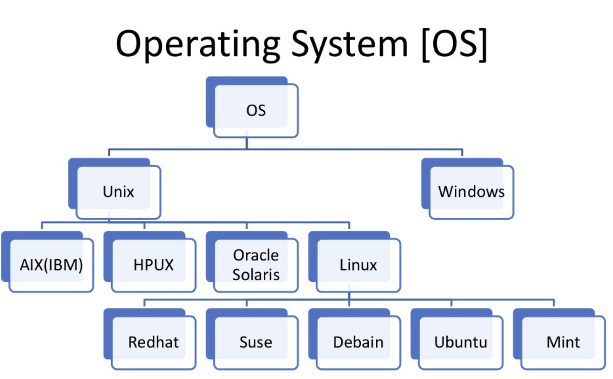

# Unix

UNIX was an operating system developed at AT&T
Bell Labs in the 1960s through the 1980s.

https://www.youtube.com/watch?v=tc4ROCJYbm0

GNU/Linux, MacOSX, and Android are all based on ideas
and specifications created by UNIX.

https://en.wikipedia.org/wiki/File:Unix_history-simple.svg

---
# time-sharing

UNIX was originally built for large mainframe
computers that many people would use at the same
time.

---
# terminals and teleprinters

* teleprinters printed program output on paper
* terminals displayed output on a CRT monitor

Neither device had processing power of their own.

Connected to the mainframe over cables or by telephone.

---
# teletype legacy: standard input and output

Every program on a UNIX system can read input from
the standard input device (stdin) and write to
standard output (stdout).

By default, stdin comes from the keyboard and
stdout gets "printed" to the graphical display.

---
# organization

The UNIX operating system is a collection of
programs, each with a special role:

* kernel
* shell
* utilities

---
# kernel

mediate access between user programs and system resources

* CPU scheduling
* I/O to computer hardware
* memory

Programs request resources by making a syscall.

---
# Shell

A shell is a computer program that can execute
other programs from a text-based interface.

In a text-based interface, you interact with a
program completely from the command-line with text
commands and text output.

Most modern shells are strongly influenced by the
first UNIX shells.

---
# Shells through the ages

* thompson shell - Ken Thompson 1971
* pwb (mashey) shell - John Mashey 1975
* bourne shell - Stephen Bourne 1977
* c shell (csh) - Bill Joy 1978
* tcsh - Ken Greer and Mike Ellis 1983
* korn shell - David Korn 1983
* bourne again shell (bash) - Brian Fox 1987
* almquist shell (ash) - Kenneth Almquist 1989
* debian almquist shell (dash) - Herbert Xu 1997

Incomplete list of popular or influential shells

---
# Utilities

Any distribution of UNIX will come with dozens of
other programs that perform narrow single-purpose
tasks.

The available utilities on a given system vary
widely but some utilities are very common.

For example, there is a command to make new
directories and another to move files.

---
# Why UNIX still matters ?

* portable to many kinds of hardware
* consistent conventions
* vast software ecosystem
* text!

---
# Places you can find a unix command-line

* wifi routers
* dsl and cable modems
* raspberry pi, beaglebone, nvidia jetson
* android phones
* linux laptop or desktop
* Mac OSX computer
* web server

You can take your command-line skills with
you to all of these platforms and more!

---
# UNIX philosophy

The unix philosophy is a set of design principles for
how programs relate to each other.

* each program should do one thing well
* the output of a program can become the input of another

Unix Programming Environment 1984
Brian Kernighan and Rob Pike

# Unix Distributions

The Unix family of operating system has wide variety of [distributions](https://upload.wikimedia.org/wikipedia/commons/1/1b/Linux_Distribution_Timeline.svg) available.
If you want to know more on linux distributions till date with popularity rankings, news and application areas then checkout [DistroWatch!](https://distrowatch.com/)

Some Anonymous stats of Popular linux distributions used on server's.

Popular linux distributions used on Personal computers.

